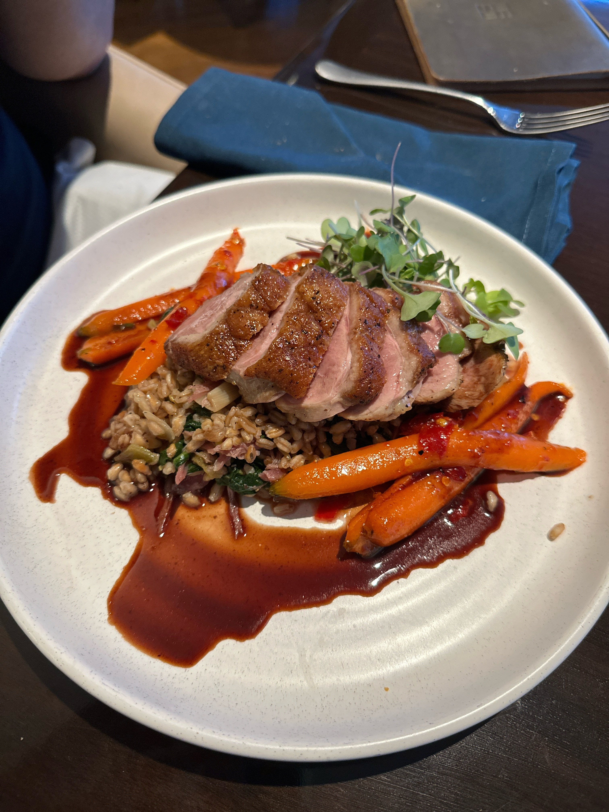
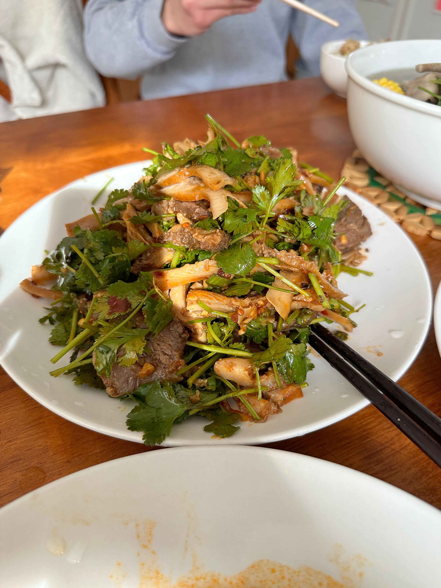
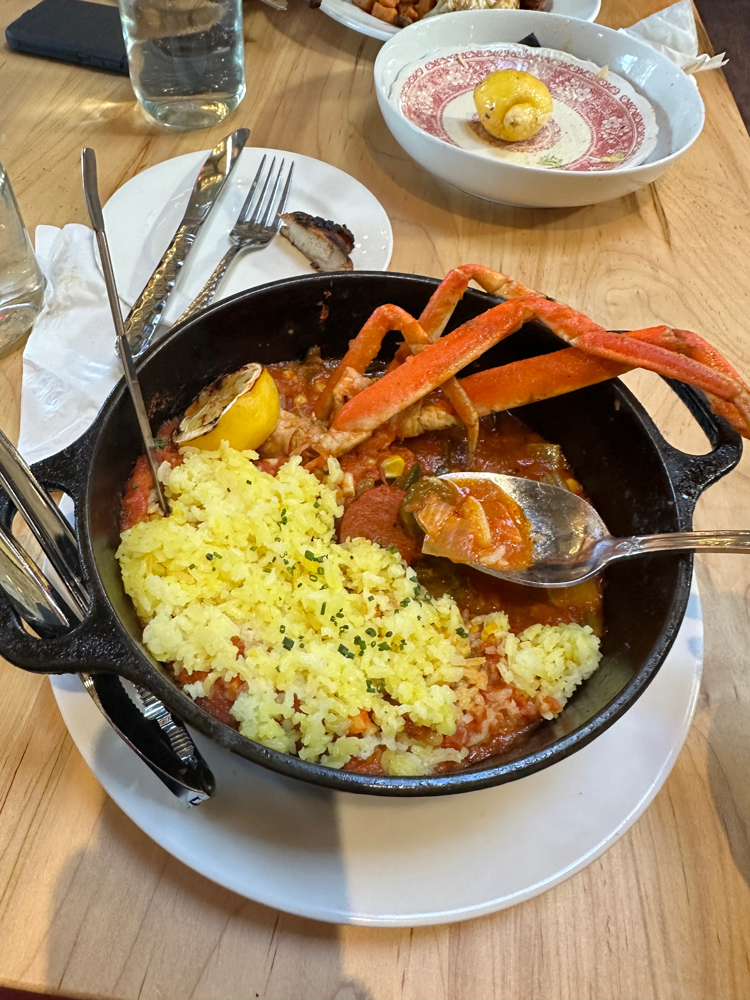
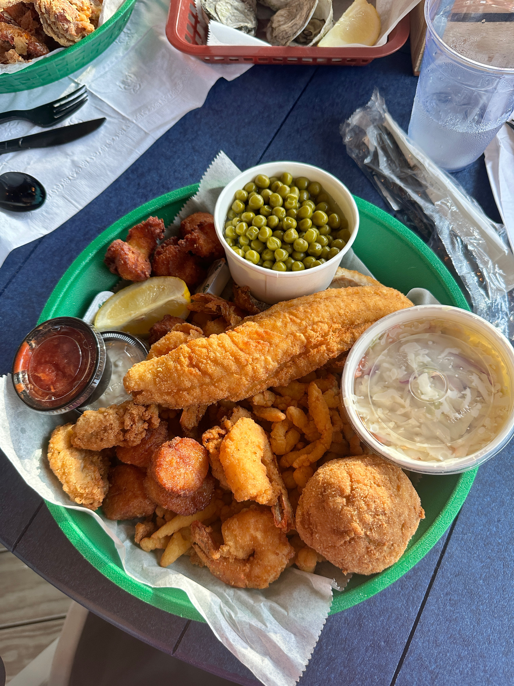

Welcome to my gallery! Click tabs to see what I've been up to.

<!-- Tab structure -->

  <button class="tablink active" onclick="openTab(event, 'undergrad')">Undergrad Graduation</button>
  <button class="tablink" onclick="openTab(event, 'orchestra')">Orchestra</button>
  <button class="tablink" onclick="openTab(event, 'food')">Food</button>
  <button class="tablink" onclick="openTab(event, 'travel')">Travel & Nature</button>

<!-- Undergrad Graduation Tab -->

  <h2>Undergrad Graduation</h2>
  
  
In the Law Quad.

  
  
My wonderful best friends.

<!-- Orchestra Tab -->

  <h2>Orchestra</h2>
  
  
  
  
Late 2024

  
  
  
Early 2021

  

<!-- Food Tab -->

  <h2>Food</h2>
  

    
    
    
    
    
    
    
    
    
    
    
    
    
    
    
    
  

<!-- Travel and Nature Tab -->

  <h2>Travel and Nature</h2>
  

    
    
    
    
    
    
  

<footer style="text-align: center; margin-top: 20px; font-size: 14px; color: #555;">
  &copy; 2025 [Danniell Hu]. All rights reserved. 
  These images are the property of Danniell Hu and may not be used or reproduced without permission.
</footer>

  &times;
  
  

<!-- Tab functionality -->

